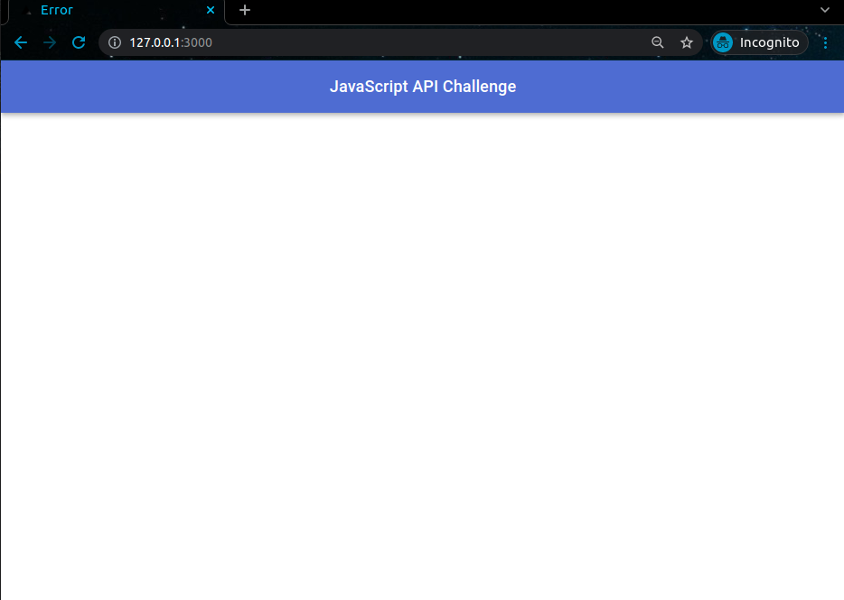
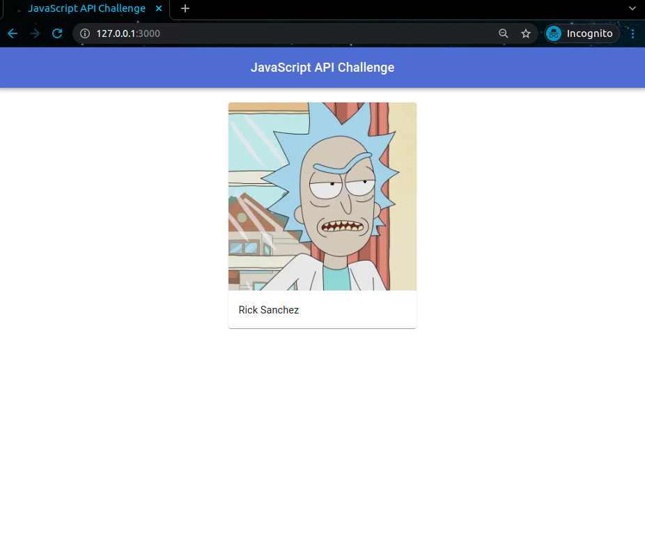
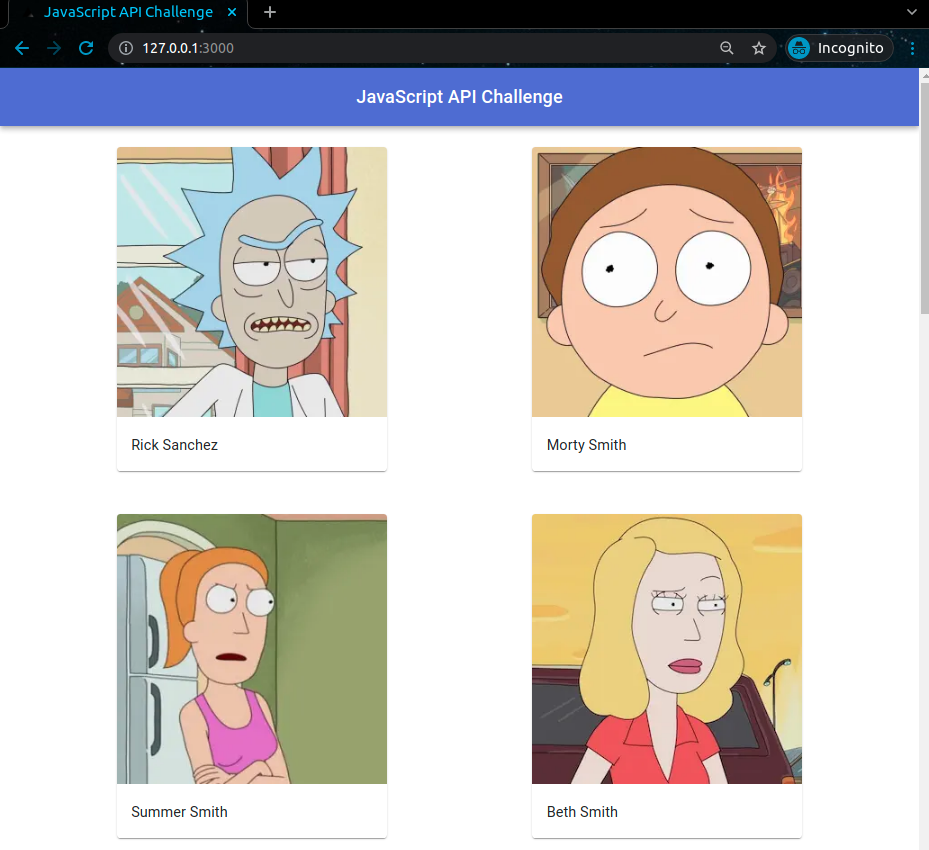
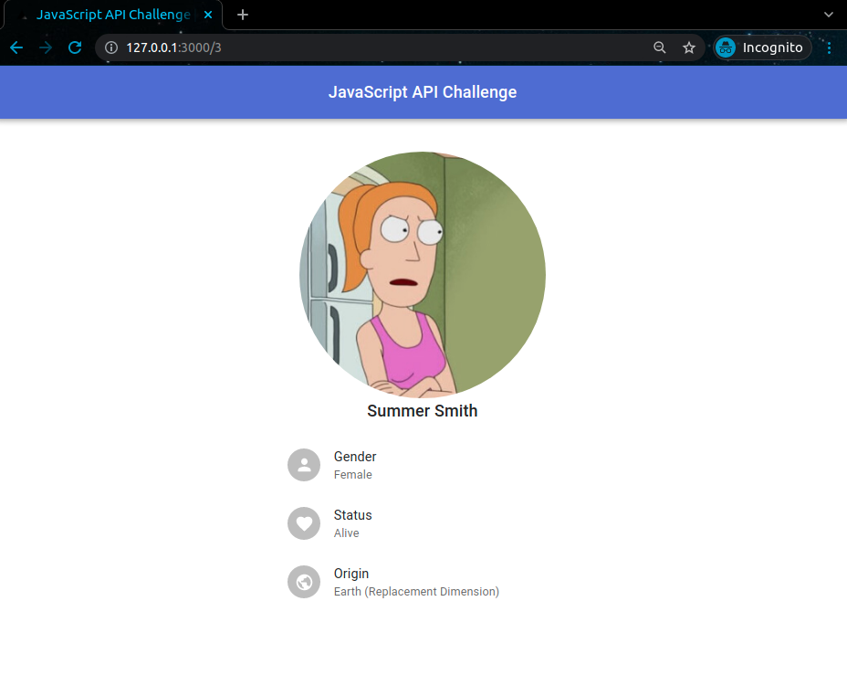

# JS API Challenge
La aplicación es un catálogo de personajes de la serie Rick y Morty, que extrae
los datos de su propia API exhibida por el mismo puerto.

Actualmente, esta API está incompleta y los datos se encuentran hardcodeados con un único personaje.

El desafío consiste en mostrar todos los personajes de la serie y sus detalles
completando los bloques de código marcados con `TODO` en las siguientes carpetas:
- `src/core`: contiene las entidades y acciones de la aplicación
- `src/pages/api`: contiene la API que usa las acciones de `src/core`
- `src/hooks`: contiene los hooks con las llamadas HTTP a la API

### Página actual




### Página a lograr




## Setup
1. Instalar las dependencias
    ```sh
    yarn install
    ```

2. Generar un propio archivo de variables de entorno para el uso de NextJS y Knex.
   ```sh
   cp .env.local.example .env.local
   ```

3. Correr las migraciones y seeds de Knex para generar la BD de SQLite:
    ```sh
    yarn run migrate:latest
    yarn run seed:run
    ```

## Librerías y Framework
Principales librerías usadas:
- [Stampit](https://stampit.js.org/), para el uso de Stamps, sobre todo en `core` para la definición de Acciones y Repositorios
- [SWR](https://swr.vercel.app/), para las consultas HTTP a la API usando React Hooks
- [Knex](https://knexjs.org/), para las consultas a la BD de SQLite

Framework usado:
- [NextJS](https://nextjs.org/), framework para React, se usa para renderizar los componentes de React y exhibir la API de personajes

Puedes revisar las demás dependencias en el archivo `package.json`.
